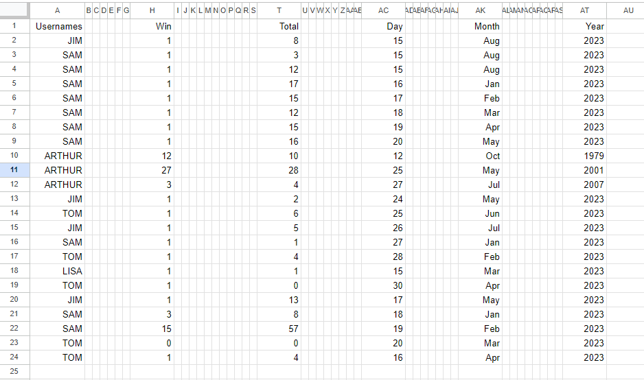

[Link to live project](https://rock-paper-scissorspp3-18513f12fbb5.herokuapp.com/)

## Introduction
- Rock, Paper, Scissors is a game that can solve any conflict and is quite possibly the best sport in the entire world!
- It is a 2 player game and can be played anywhere.
- The rules are simple: rock beats scissors, scissors beats paper, and paper beats rock.

## Existing Features

### Welcome Message
- When a new game starts the welcome message is displayed.
- The user is welcomed with an emoji of a Rock, Paper and Scissors.

### Username Input
- The user is asked for a user name, this user name will be used to save there score.

### Menu selection
- After the user name is entered the menu selection appears.
- From the menu area -
    * The user can play the game.
    * Read the instructions.
    * Read there score. 
    * Change user name.
    * Exit the game

Features Image

### Game Area
- In the game area the user is asked to enter either R for Rock, P for Paper, and S for Scissors.
- If another letter or number is entered as error will appear, That input isn't valid. Please enter 'R' OR 'P' OR 'S'!".
- The computers choice is random, and the computers result is checked againest the user choice.
- The users and computers choice is displayed to the user and if it's a Win, Loae or Draw.
- The user has a choice to continue to play for ever, or they can exit the game or go back to the menu.
- It is at this point the number of wins and total games played are saved to google sheets for later display.

### New User Name
- A new player can enter there username without exiting the game and starting the game again.

### Score Area
- This area shows the current user there score.
- The user can see there results for the last 10 games that they have played.
- The user can search for other users by there user name.
   

## Features to implement in future
- Count the number of times the user entered P, R or S, to see if the user has a preference.
- Create a leader board for the top 10 highest scores.

## Colour
- Colour for the win result and lose result text was selected, as it is more initially noticeable to see a Green colour for a win and a Red colour for a lose. 
- A draw result was left as white.

## Google Sheet Access 

Googlesheet is used to store, usernames and game won along with total games played.

## Flow-Chart
A flow chart for this game created with the help of Lucid [Web-Site](https://lucid.app/documents#/dashboard)

## Testing
- Testing has been implemented throughout the entire project mainly debugging through running the program in the CodeAnyWhere terminal.
- Tested in both CodeAnyWhere terminal and Heroku terminal.
- CI Python linter/Syntax checker [pep8ci](https://pep8ci.herokuapp.com/)

## Bug
- There was a bug when saving the results to google sheets. I the image below it can be seen that the results for Tom's first go is in Row 2 and the results for wins and total games are also in row 2. When the game is played again the results for win and total games don't go into the next row they went into Column A. The same happened for the 3rd and 4ft and so on. 
- I selected H for the win column and tested the code then and this worked, I then tested column's C,D,E,F,G to append the results and the same issue would happen. 
- The work around for this was to append the results for wins in column H and for total games into column T.

## Deployment
- Heroku was used to deploy the website.
- It is assumed here that GitHub accounts are already set up.
- In CodeAnyWhere a \n needs to added at the end of the text inside the input method, for a software quirk.
- To create our list of requirements, we  use the following command in the terminal.
- The requirements.txt file was populated using the command "pip3 freeze > requirements.txt' in CodeAnyWhere.
- Commit them and push the changes up to Github from CodeAnyWhere.
- Create our account with [Heroku](https://id.heroku.com/login).
- Heroku will then send you a confirmation email, click the linl and login.
- In Heroku clicking on the button 'New' and select 'Create New App'.
- The app name on Heroku has to be unique.
- Then you can select your region.
- Then click “Create app”.
- Go the settings tabs.
- Then config vars and upload the creds.json file.
- In the field for key, enter CREDS.
- Copy the entire creds.json file, and paste it into the value field here.
- Click “Add”.
- Next step is to Add buildpack”. The 1st buildpack is Python, then click “Save changes”.
- The other buildpack  we need is called node.js click Save again.
- The order for the buildpacks is important also so its Python on top, and node.js underneath.
- Project settings are completed, Next step is in the deploy section.
- Github was selectted, for deployment method.
- Connect to GitHut, and search for the Github repository name. Then click connect.
- From here you can select Automatic or Manual deploy.
- Automatic deploy will re-deploy the application every time the project is "git pushed".
- If you select "Manual deploy", after the project has been built, click "view" to see the deployed page.
- “App was successfully deployed” message will appear, and a link to the deployed app.
- Click on the link to test for error's.
 

## Technologies Used
- [Google Spreadsheets](https://docs.google.com/spreadsheets/create)
- [Python](https://www.python.org/)
- [GitHub](https://github.com/)
- [Heroku](https://www.heroku.com/about)
- [LucidCharts](https://www.lucidchart.com/pages/)

## Credits
- Google Developers site was a great tool for research to access and edit Google sheet: [Google Developers](https://developers.google.com/sheets/api/guides/create).
- To create font colour and background colour: [Python font colour](https://www.lihaoyi.com/post/BuildyourownCommandLinewithANSIescapecodes.html).
- To transfer variables from one function to another: [stackoverflow global statement](https://stackoverflow.com/questions/10506973/can-not-increment-global-variable-from-function-in-python).
- In the printing of the scores, inspiration and research was found at the following sites,
    - [strip() Method](https://www.w3schools.com/python/ref_string_strip.asp),
    - [Last Lecords](https://www.geeksforgeeks.org/get-last-n-records-of-a-pandas-dataframe/),
    - [Print in Python](https://stackoverflow.com/questions/69472788/how-to-get-columns-titles-from-googlesheets-to-print-in-python),
    - [Search Row for Data](https://stackoverflow.com/questions/63033616/python-google-sheets-check-in-which-row-the-data-is).
    - [Search Column for Data](https://stackoverflow.com/questions/61599272/google-sheets-search-column-for-value-using-python).
    - [Iterate Rows for Data](https://stackoverflow.com/questions/74547789/iterate-over-pandas-rows-and-using-shift-in-if-statement).
    - [Sum Count Results](https://stackoverflow.com/questions/75196357/sum-last-n-rows-of-df-count-results-into-one-row).
    - [Google Sheets Guide](https://understandingdata.com/posts/the-comprehensive-guide-to-google-sheets-with-python/).
    - [Read/Write Google Sheets Guide](https://aryanirani123.medium.com/read-and-write-data-in-google-sheets-using-python-and-the-google-sheets-api-6e206a242f20).

